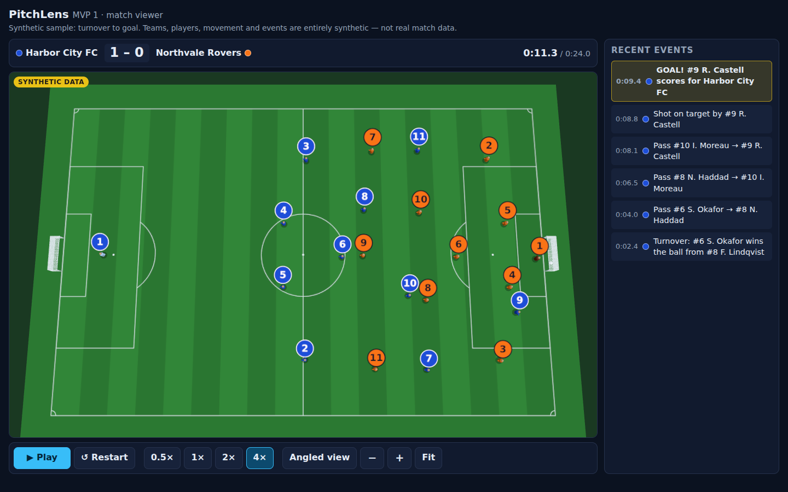

# PitchLens

PitchLens is a prototype for the MS and Premier League hackathon. **MVP 1** is a 3D match viewer that plays back a short, scripted football sequence on a 3D pitch. The default camera looks down from above.

> **Everything shown is synthetic.** The teams (Harbor City FC and Northvale Rovers), the players, their movement and the events are made up for the demo. The app uses no real match data, footage or club branding, and it makes no network calls at runtime.



## Getting started

Requires Node.js 20.9 or newer.

```bash
npm install
npm run dev        # http://localhost:3000
```

| Command | What it does |
| --- | --- |
| `npm run dev` | Development server with hot reload |
| `npm run build` | Production build |
| `npm start` | Serve the production build (run `npm run build` first) |
| `npm test` | Unit tests (Vitest): playback clock, event processing, restart, fixture validity |
| `npm run typecheck` | `tsc --noEmit` |

### Using the viewer

- **Play / Pause** and **Restart**. Pressing Play at the end starts the sequence again.
- **Speeds:** 0.5×, 1×, 2× and 4×.
- **Angled view** switches between the default overhead camera and a broadcast-style angle.
- **Zoom:** use the − / + buttons, the mouse wheel, or a pinch. When zoomed in, drag to pan. **Fit** resets the view.
- The **Recent events** panel shows an event only after playback reaches its timestamp. The score works the same way.
- On portrait screens (phones) the camera turns 90° so the pitch runs from top to bottom.
- If WebGL isn't available, a message replaces the 3D view. Playback, the clock, the score and the events panel still work.

## Architecture

```
src/
  match/                  Data. Has no rendering or React dependencies.
    contract.ts           Versioned TypeScript data contract (schema 1.0.0)
    fixture.ts            Deterministic scripted sample fixture and the builder that makes it
    validate.ts           Structural validation of any fixture
  playback/               Playback logic. Has no rendering dependencies.
    derive.ts             Pure functions: positions, score and events at time t
    engine.ts             PlaybackEngine: the single simulation clock
  scene/                  Three.js only. Has no clock of its own.
    coords.ts             Conversion from pitch space to scene space
    Pitch.ts              Grass, markings and goals (static)
    Player.ts             One reusable player model, created 22 times
    Ball.ts               Ball and its height shadow
    MatchScene.ts         Puts the scene together: lights, cameras, zoom/pan, resize, dispose
  components/             React UI
    MatchViewer.tsx       Runs the one requestAnimationFrame loop and connects engine → scene → UI
    PlaybackControls.tsx, Scoreboard.tsx, EventFeed.tsx
  app/                    Next.js App Router page and layout
tests/                    Vitest suites
```

How data moves through one animation frame:

1. `MatchViewer`'s `requestAnimationFrame` loop measures the real time since the last frame (capped at 250 ms so a backgrounded tab doesn't jump ahead) and calls `engine.advance(delta)`.
2. The engine multiplies that time by the playback speed and moves its clock forward, stopping at the end of the fixture. While paused, it doesn't move.
3. `engine.frame()` derives the interpolated player and ball positions, possession, score and revealed events, using only the fixture and the current time.
4. `MatchScene.update(frame)` sets every player and ball transform from that frame, then draws the scene. The player and ball models have no timers and keep no state between frames.
5. React re-renders only when something it displays changes: the clock (to 0.1 s), the score, the event count, play/pause or the speed.

Because everything is derived from the current time, results don't depend on frame rate. When one frame crosses several event timestamps, all of those events appear together, in order. Restarting returns to the fixture's starting state.

### Cleanup

When `MatchViewer` unmounts, it cancels the animation frame and calls `MatchScene.dispose()`. That call:

- removes all DOM listeners through an `AbortController`
- disconnects the `ResizeObserver`
- disposes every geometry, material and texture in the scene
- disposes the renderer, forces the WebGL context to be released, and removes the canvas

In dev mode, React StrictMode mounts and unmounts the viewer twice, which exercises this path.

## Data format

The full contract is in [`src/match/contract.ts`](src/match/contract.ts). In summary:

- **`MatchFixture`**:
  - `schemaVersion` (`"1.0.0"`), `matchId`, `title`, `synthetic: true`, and `durationMs`.
  - `teams`: two `Team`s, each with a stable `id`, a `side` (home or away), names, kit colours and attacking direction.
  - `roster`: 22 `Player`s, each with a stable `id`, a `teamId`, a shirt number and a role.
  - `startingState`: the score and possession at t = 0. The displayed score is always this plus the goals revealed so far. The final result is never stored or shown in advance.
  - `snapshots`: ordered position samples (every 100 ms in the sample fixture), each with `t` in ms, all 22 players (`x`, `y`, `facing`), the ball (`x`, `y`, `z`) and `possession`. Possession is `null` while the ball is in flight or dead.
  - `events`: ordered `MatchEvent`s, each with a unique `id`, `t` in ms, a `type` (`kickoff | turnover | pass | shot | goal`), a team, an optional player, an `outcome`, start and end positions, and a description. Passes name their `recipientId`.
- **When events appear:** an event's `t` is the moment it resolves and becomes visible. For a pass that is the moment of reception, and `startT` records when the ball was struck. For a shot it is the strike, and for a goal it is the ball crossing the line.
- **Discontinuities:** a snapshot with `discontinuity: true` starts a new continuous segment, such as the kickoff reset after a goal. Playback holds the previous snapshot until that instant and then jumps to the new one. It never interpolates between them, so neither the ball nor the players slide across the pitch.

### Coordinates

The pitch is 105 × 68 m:

- `x` runs from 0 to 105 along the length (from the left goal line to the right one).
- `y` runs from 0 to 68 across the width (from the top touchline to the bottom one).
- `z` is height in metres.
- `facing` is in radians: 0 points along +x and π/2 along +y.

Three.js scene space is y-up, with 1 unit = 1 m and the centre spot at the origin (see `src/scene/coords.ts`):

```
scene.x = x − 52.5      scene.y = z      scene.z = y − 34      rotation.y = −facing
```

### The sample sequence

| t (s) | Event |
| --- | --- |
| 2.4 | Turnover: Harbor City #6 wins the ball from Northvale #8 |
| 4.0 | Pass #6 → #8 (ground) |
| 6.5 | Pass #8 → #10 (lofted) |
| 8.1 | Pass #10 → #9 |
| 8.8 | Shot on target by #9 |
| 9.4 | Goal, making it 1–0. The ball crosses the line, then hits the net |
| 10.5–19.0 | Players walk back to their kickoff positions |
| 19.5 | Kickoff by Northvale (a discontinuity snapshot moves the ball to the centre spot) |
| 21.0 | Pass from the kickoff, #9 → #8 |

`buildSampleFixture()` builds the sequence from keyframes. Players involved in the play follow scripted paths. Off-ball players hold a 4-3-3 formation that shifts toward a slightly delayed track of where the ball is, with a small deterministic sway. Ball contact points come from the touching player's position and facing, so passes, receptions and the shot line up with their events. The builder uses no randomness, so building the fixture twice gives identical output; the tests check this.

## Validation

| Check | Result |
| --- | --- |
| `npm test` | 63 tests pass: fixture validity, ball/event sync, kickoff reset, movement speed limits, the clock, pause/resume, every speed with several frame sizes, large frames that cross multiple events, no early reveals, deterministic replay, restart (including from a nonzero starting score), validator rejection of non-finite values and invalid team sides, and the viewer showing validation errors instead of crashing |
| `npm run typecheck` | Passes |
| `npm run build` | Passes. The `/` route is prerendered as static content |

I also checked the app by hand in headless Chromium (SwiftShader WebGL) at 1440×900 and 390×844:

- The 3D view, all controls, and pause freezing the clock work.
- Restart resets the score, events and clock.
- There is no horizontal scroll on mobile.
- After an unmount, no canvas, live WebGL context or animation-frame callback remains.

## Known limitations

- There is one hard-coded fixture and no loader for external fixture files yet. Any data that follows the contract can be passed to `MatchViewer`.
- The player models are simple capsules. The number badges stay the same size on screen, and players and the ball are drawn slightly larger than life so they stay readable from the overhead camera.
- Movement is linear between keyframes and 100 ms snapshots. There is no physics, animation rigging or tactical logic.
- The kickoff reset is an instant cut. Players walk back beforehand, so in practice only the ball jumps.
- There's no seek bar or keyboard shortcuts yet. All controls are standard buttons and work with Tab, Enter and Space.
- Pinch zoom and pan on the canvas turn off the browser's touch scrolling over the 3D view. On mobile, scroll the page using the area outside the view.
- Shadows are simple discs. No real-time shadow maps are used.
