# PitchLens

## Playback statistics (MVP 4)

The match statistics panel compares possession, completed passes, shots, saves,
and goals for both teams at the current playback time. Seeking backwards removes
later totals; restarting or generating a match resets the panel. Both fixture
schemas are supported, and statistics also work without WebGL.

Possession measures controlled time using snapshot intervals, excluding ball
flight and dead-ball time. Percentages remain blank until there is controlled
time and are rounded to sum to 100%. Completed passes count only successful
receptions. Shots count at the strike; saves count only when the result arrives
and are credited to the defending team. Goals count goals in this sequence,
excluding any score carried into its starting state. These are synthetic sequence
statistics, not full-match or predictive metrics.

`statisticsAt` in `src/playback/statistics.ts` derives totals without modifying
the fixture or keeping counters, so playback speed does not affect results.

PitchLens is a prototype for the MS and Premier League hackathon. **MVP 1** is a 3D match viewer that plays back a short, scripted football sequence on a 3D pitch. The default camera looks down from above.

> **Everything shown is synthetic.** The teams (Harbor City FC and Northvale Rovers), the players, their movement and the events are made up for the demo. The app uses no real match data, footage or club branding, and it makes no network calls at runtime.

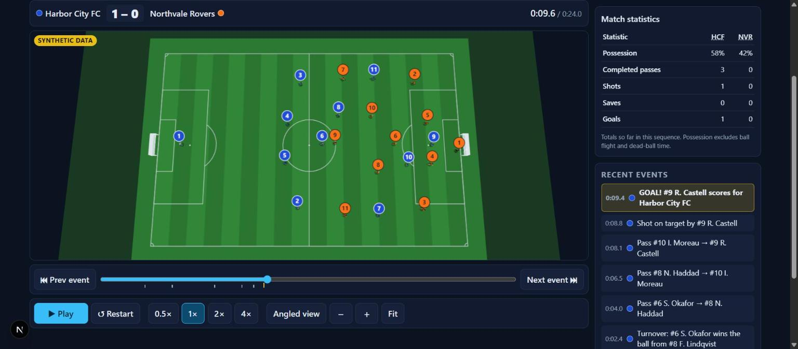

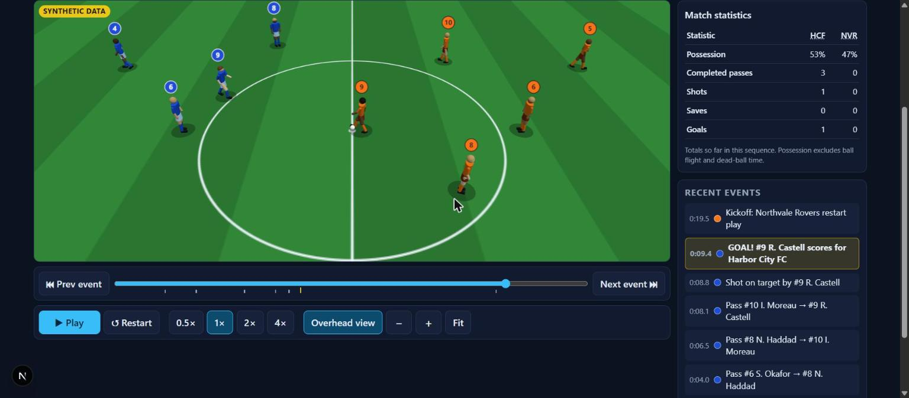

## Getting started

Requires Node.js 20.9 or newer.

```bash
npm install
npm run dev        # http://localhost:3000
```

| Command | What it does |
| --- | --- |
| `npm run dev` | Development server with hot reload |
| `npm run build` | Production build |
| `npm start` | Serve the production build (run `npm run build` first) |
| `npm test` | Unit tests (Vitest): playback clock, seeking and event navigation, statistics, fixture validity, ball physics, simulator replay and event/contact alignment, match rules, contact recognition and animation poses |
| `npm run test:live` | Opt-in live evaluation of the explanation service against a Microsoft Foundry deployment (paid; needs `PITCHLENS_LIVE_EVAL=1` and the `FOUNDRY_*` variables, see [docs/explain-service.md](docs/explain-service.md)) |
| `npm run typecheck` | `tsc --noEmit` |

### Using the viewer

The viewer works like a match on TV (see [Broadcast mode](#broadcast-mode-mvp-8) below):

- On first visit, **Kick off the demo** plays the scripted demo. **Set up your own match** opens the set-up drawer.
- The **control bar** at the bottom has:
  - restart, previous and next moment, play/pause, and speed (0.5×, 1×, 2× or 4×)
  - the **timeline**, which gets an icon button for each key moment as it happens
  - the **Broadcast** / **Top** camera switch, zoom − / + / fit, and the **Pro data** switch
- Zoom also works with the mouse wheel or a pinch. When zoomed in, drag to pan.
- The **score bug**, the **moment pop-ups**, the **live feed** and **Match centre** only show what has happened by the current playback time.
- If WebGL isn't available, a message replaces the 3D view. Playback, the score, the feed and Match centre still work.
- Offside calls with a recorded kick frame get a three-second review: the pitch freezes at the pass, a yellow line marks the offside boundary, and an orange ring highlights the flagged player. The line uses the ball or the second-last opponent, whichever is closer to goal. The match clock, score and feed stay at the whistle. **Continue** resumes immediately; otherwise playback resumes automatically at the same speed. Seeking skips the automatic review; replaying through the call shows it again. Calls without a recorded kick frame retain the normal offside banner.

## Architecture

```
src/
  match/                  Data. Has no rendering or React dependencies.
    contract.ts           Versioned TypeScript data contract (schema 1.0.0)
    fixture.ts            Deterministic scripted sample fixture and the builder that makes it
    validate.ts           Structural validation of any fixture
  playback/               Playback logic. Has no rendering dependencies.
    derive.ts             Pure functions: positions, score and events at time t
    statistics.ts         Pure function: match statistics at time t
    moments.ts            Pure functions: key moments, pop-ups and the live feed at time t
    proData.ts            Pure functions: Pro data chips and extra statistics from fixture data
    animation.ts          Pure functions: player speed, distance travelled and ball contacts (kicks, throws, saves, tackles…) at time t
    engine.ts             PlaybackEngine: the single simulation clock
  simulation/             Seeded match producer. Has no rendering or playback dependencies.
    ball.ts               Deterministic ball physics: flight, bounce, roll
    generate.ts           Fixed-timestep simulator: rules, restarts, collisions and deflections; records snapshots and events
  explain/                "Explain this moment". No rendering, React or network dependencies.
    context.ts            Evidence package for one playback time, with no data from after it
    response.ts           Explanation response contract and its runtime validator
    evidence.ts           Cutoff-bound evidence tools for the analyst model
    grounding.ts          Deterministic wording checks against the cited evidence
    prompts.ts            Analyst and verifier instructions and output schemas
    matchRef.ts           Match references: how the browser names a match without sending it
    api.ts                HTTP request/response contract for /api/explain
  server/                 Server-only code for /api/explain
    foundry.ts            Microsoft Foundry chat completions client (v1 API) and configuration
    analyst.ts            Bounded analyst → checks → verifier workflow with one revision
    resolveMatch.ts       Rebuilds a referenced match with the simulator
    guard.ts              Rate, concurrency and cache controls
    explainHandler.ts     The endpoint: validation, errors, logging
  scene/                  Three.js only. Has no clock of its own.
    coords.ts             Conversion from pitch space to scene space
    Pitch.ts              Grass, markings and goals (static)
    pose.ts               Joint angles for idle, running and every ball contact (kick, throw-in, save and dive, tackle, block, fall)
    rig.ts                Footballer skeleton: one matrix per body part from a pose
    Player.ts             Procedural footballers, instanced across all 22 players
    Ball.ts               Ball and its height shadow; sized to the camera zoom
    MatchScene.ts         Puts the scene together: lights, cameras, zoom/pan, resize, dispose
  components/             React UI
    SampleMatchViewer.tsx App shell: loaded match, set-up drawer, Pro data preference, first-visit card
    MatchViewer.tsx       Runs the one requestAnimationFrame loop and connects engine → scene → broadcast overlays
    ScoreBug.tsx, MomentBanner.tsx, LiveFeed.tsx, Timeline.tsx, PlaybackControls.tsx, MatchCentre.tsx,
    MatchStats.tsx, Formations.tsx, SetupDrawer.tsx, TeamBadge.tsx, Icon.tsx
    eventCopy.ts          Plain-language titles, icons and explanations for events
    setup.ts              Set-up form model, per-field validation, tactics configuration
  app/                    Next.js App Router page and layout, and the api/explain route
tests/                    Vitest suites
tests-live/               Opt-in live evaluation (npm run test:live)
```

How data moves through one animation frame:

1. `MatchViewer`'s `requestAnimationFrame` loop measures the real time since the last frame (capped at 250 ms so a backgrounded tab doesn't jump ahead) and calls `engine.advance(delta)`.
2. The engine multiplies that time by the playback speed and moves its clock forward, stopping at the end of the fixture. While paused, it doesn't move.
3. `engine.frame()` derives the interpolated player and ball positions, possession, score and revealed events, using only the fixture and the current time.
4. `MatchScene.update(frame)` sets every player and ball transform from that frame, poses each player from `motionAt(fixture, time)`, then draws the scene. The player and ball models have no timers and keep no state between frames.
5. React re-renders only when something it displays changes: the clock (to 0.1 s), the score, the event count, play/pause or the speed.

Because everything is derived from the current time, results don't depend on frame rate. When one frame crosses several event timestamps, all of those events appear together, in order. Restarting returns to the fixture's starting state.

### Cleanup

When `MatchViewer` unmounts, it cancels the animation frame and calls `MatchScene.dispose()`. That call:

- removes all DOM listeners through an `AbortController`
- disconnects the `ResizeObserver`
- disposes every geometry, material and texture in the scene
- disposes the renderer, forces the WebGL context to be released, and removes the canvas

In dev mode, React StrictMode mounts and unmounts the viewer twice, which exercises this path.

## Data format

The full contract is in [`src/match/contract.ts`](src/match/contract.ts). In summary:

- **`MatchFixture`**:
  - `schemaVersion` (`"1.0.0"`), `matchId`, `title`, `synthetic: true`, and `durationMs`.
  - `teams`: two `Team`s, each with a stable `id`, a `side` (home or away), names, kit colours and attacking direction.
  - `roster`: 22 `Player`s, each with a stable `id`, a `teamId`, a shirt number and a role.
  - `startingState`: the score and possession at t = 0. The displayed score is always this plus the goals revealed so far. The final result is never stored or shown in advance.
  - `snapshots`: ordered position samples (every 100 ms in the sample fixture), each with `t` in ms, all 22 players (`x`, `y`, `facing`), the ball (`x`, `y`, `z`) and `possession`. Possession is `null` while the ball is in flight or dead.
  - `events`: ordered `MatchEvent`s, each with a unique `id`, `t` in ms, a `type` (`kickoff | turnover | pass | shot | goal`), a team, an optional player, an `outcome`, start and end positions, and a description. Passes name their `recipientId`.
- **When events appear:** an event's `t` is the moment it resolves and becomes visible. For a pass that is the moment of reception, and `startT` records when the ball was struck. For a shot it is the strike, and for a goal it is the ball crossing the line.
- **Discontinuities:** a snapshot with `discontinuity: true` starts a new continuous segment, such as the kickoff reset after a goal. Playback holds the previous snapshot until that instant and then jumps to the new one. It never interpolates between them, so neither the ball nor the players slide across the pitch.

### Coordinates

The pitch is 105 × 68 m:

- `x` runs from 0 to 105 along the length (from the left goal line to the right one).
- `y` runs from 0 to 68 across the width (from the top touchline to the bottom one).
- `z` is height in metres.
- `facing` is in radians: 0 points along +x and π/2 along +y.

Three.js scene space is y-up, with 1 unit = 1 m and the centre spot at the origin (see `src/scene/coords.ts`):

```
scene.x = x − 52.5      scene.y = z      scene.z = y − 34      rotation.y = −facing
```

### The sample sequence

| t (s) | Event |
| --- | --- |
| 2.4 | Turnover: Harbor City #6 wins the ball from Northvale #8 |
| 4.0 | Pass #6 → #8 (ground) |
| 6.5 | Pass #8 → #10 (lofted) |
| 8.1 | Pass #10 → #9 |
| 8.8 | Shot on target by #9 |
| 9.4 | Goal, making it 1–0. The ball crosses the line, then hits the net |
| 10.5–19.0 | Players walk back to their kickoff positions |
| 19.5 | Kickoff by Northvale (a discontinuity snapshot moves the ball to the centre spot) |
| 21.0 | Pass from the kickoff, #9 → #8 |

`buildSampleFixture()` builds the sequence from keyframes. Players involved in the play follow scripted paths. Off-ball players hold a 4-3-3 formation that shifts toward a slightly delayed track of where the ball is, with a small deterministic sway. Ball contact points come from the touching player's position and facing, so passes, receptions and the shot line up with their events. The builder uses no randomness, so building the fixture twice gives identical output; the tests check this.

## Validation

| Check | Result |
| --- | --- |
| `npm test` | 291 tests pass. As well as the MVP 1–4 suites (fixture validity, clock, speeds, seeking, no early reveals, restart, statistics, validator and viewer error handling), MVP 5 adds ball trajectories, deterministic replay, pitch boundaries, event/contact alignment, statistics compatibility and animation poses, and MVP 6 adds the match rules, collisions, deflections and contact animations (see those sections) |
| `npm run typecheck` | Passes |
| `npm run build` | Passes. The `/` route is prerendered as static content |

For MVP 1 I also checked the app by hand in headless Chromium (SwiftShader WebGL) at 1440×900 and 390×844 (the MVP 5 visual checks are listed in that section):

- The 3D view, all controls, and pause freezing the clock work.
- Restart resets the score, events and clock.
- There is no horizontal scroll on mobile.
- After an unmount, no canvas, live WebGL context or animation-frame callback remains.

## Known limitations

- There is one hard-coded fixture and no loader for external fixture files yet. Any data that follows the contract can be passed to `MatchViewer`.
- The number badges stay the same size on screen, and players are drawn larger than life (1.4×) so they stay readable from the overhead camera. The ball is drawn much larger from the full-pitch view and shrinks to the players' scale as you zoom in.
- Playback is linear between snapshots. The scripted demo is keyframed and has no physics or rules; only the seeded simulator has them. Tactics are limited to holding a shape, pressing, covering, cutting out passes and timing forward runs.
- The kickoff reset is an instant cut. Players walk back beforehand, so in practice only the ball jumps.
- There are no global keyboard shortcuts. All controls are standard buttons and a native slider, and work with Tab, Enter, Space and the arrow keys.
- Pinch zoom and pan on the canvas turn off the browser's touch scrolling over the 3D view. On mobile, scroll the page using the area outside the view.
- Shadows are simple discs. No real-time shadow maps are used.
- The rules are simplified; see "Not in this milestone" under MVP 6.

## Seeded simulator (MVP 2)

Use **Generate match** with an integer seed (0–4294967295) and a duration.
The same seed, duration, and simulator version reproduce the same match.
**Scripted demo** restores the original MVP 1 fixture. Generation resets playback
and starts paused; playback speed does not change simulation outcomes.

`generateMatch({ seed, durationMs })` in `src/simulation/generate.ts` is a pure
TypeScript producer, independent of the renderer. It uses a fixed timestep
(20 ms since MVP 5, with snapshots every 100 ms plus one at each ball contact),
a seeded PRNG, speed-limited formation movement, carrying, passes, interceptions,
shots, saves, goals, and simplified dead-ball restarts. Since MVP 5 those
outcomes come from simulated ball movement; see the MVP 5 section below.

Generated fixtures use schema **1.1.0**; the original **1.0.0** fixture remains
supported. New event types are `shot-result` and `goal-kick`; new outcomes are
`pending`, `intercepted`, `saved`, and `missed`. A `shot` is published at the strike
with outcome `pending`, with no future destination. Its result appears only on
arrival as `goal` or `shot-result`. Failed passes preserve the intended recipient;
a following turnover identifies the interceptor. Equal-time events retain array
order. Results are simplified sampled outcomes, not predictions of real football.

After a goal the conceding team kicks off. Misses lead to a simplified goal kick.
Dead-ball periods last two seconds, followed by an explicit discontinuity cut to
restart positions. The viewer never interpolates through this cut. There are no
real throw-ins, corners, fouls, offsides, substitutions or fatigue yet.
Durations are 10–180 seconds in 100 ms increments through the API; the UI offers
30, 60, and 120 seconds. A sequence can end during a ball flight, with no invented
completion event. This is a synthetic demo generator, not a calibrated tactical model.

Tests cover multiple seeds, deterministic replay, bounded player speed, valid
fixtures, possession at reception, goal scoring, conceding-team kickoffs, and
coverage of goals, saves, misses, and interceptions. Original demo tests remain.

## Seeking and event navigation (MVP 3)

`PlaybackEngine` gained `seek(t)`, `seekToPreviousEvent()` and `seekToNextEvent()`.
Seeking only moves the clock (clamped to the fixture; non-finite values are ignored).
Positions, ball, possession, score and the event feed are all pure functions of that
time (`frameAt`), so a seek gives exactly the same frame as playing to that time and
never reveals later events — including when scrubbing backwards, where the score and
feed shrink again. Seeking does not emit crossed events, and playing on afterwards
reports only events after the new position. The discontinuity rule still applies:
a seek into a kickoff reset never interpolates across the cut.

Event navigation uses distinct event timestamps (equal-time events share one stop),
strictly before/after the current time. Landing on an event includes it in the feed
and score. Both fixture schemas (1.0.0 and 1.1.0) are covered by `tests/seek.test.tsx`.
Statistics and match import/export are not part of this milestone.

## Footballers and ball physics (MVP 5)

### Player models and animation

The capsules are replaced by procedural footballers: head and hair, shirt, shorts,
arms, and legs with socks and boots, coloured from the team kit in the fixture
(goalkeepers wear the secondary colour with long sleeves and dark shorts). Skin and
hair tones vary per player from a hash of the player ID.

**Asset sources:** there are none to license. Every shape is built in
`src/scene/Player.ts` from Three.js primitives (capsules, cylinders, spheres, a
box for each boot), and the shirt numbers are drawn at runtime onto canvas
textures with the system font. No models, textures, fonts or animation clips are
downloaded or bundled. Three.js itself is MIT licensed.

Animation is derived, not simulated. `src/playback/animation.ts` reads the recorded
snapshots and returns, for any time, each player's speed, the distance they have
travelled and their offset from a ball strike. `src/scene/pose.ts` turns that into
joint angles:

- **Idle:** a slow sway and breathing bob when a player is nearly stationary.
- **Running:** the stride phase comes from distance travelled (one cycle per 2.8 m),
  so feet keep pace with the ground at any playback speed; stride length, knee lift,
  arm swing and forward lean grow with speed.
- **Kicking:** a backswing starting 220 ms before contact, the boot meeting the ball
  at the contact instant, and a follow-through that blends out over 380 ms.

A strike is recognised from snapshots alone: the instant a player's possession ends
with nobody on the ball. That is the same instant the simulator releases the ball
from the foot, and it works for the scripted demo too. Events are never read, and
the pose is a pure function of the fixture and the time, so seeking, restarting and
changing speed show identical poses. The only look-ahead is the 220 ms wind-up,
which reads upcoming snapshots; it never touches the feed, score, timeline or
statistics.

**Shirt numbers** appear on the back of each shirt and on the camera-facing badge
above the head, which keeps a constant on-screen size.

**Ball size:** from the full-pitch view the ball is drawn at 0.38 m radius so it
can be seen at all. As the camera zooms in it shrinks, reaching a real ball at the
players' scale from 2.2× zoom, so it stays in proportion with the players. This is
presentation only; recorded ball positions are unchanged.

**Mobile performance:** each body part is one `InstancedMesh` shared by all 22
players with per-instance kit colours, so every body on the pitch costs 10 draw
calls (the capsule version used 5 meshes per player, 110 in total). Badges and back
numbers add 2 per player. A footballer is roughly 1,000 triangles, materials are
Lambert, and there are still no shadow maps. These numbers are counted from the
scene structure; I have not profiled on a physical phone.

### Ball physics

`src/simulation/ball.ts` is a small deterministic model, not a rigid-body engine:

- **In the air:** constant gravity, no drag, integrated exactly per step.
- **Bounces:** vertical speed × 0.55 and horizontal speed × 0.8 at each impact; a
  bounce that would rebound slower than 0.9 m/s settles into a roll.
- **On the ground:** constant 1.8 m/s² deceleration until the ball stops.

The simulator advances players and ball in fixed 20 ms steps from one seeded PRNG
stream. Outcomes are read off the ball's path rather than decided in advance:

- A pass or shot leaves from the kicker's foot (0.55 m ahead of them along their
  facing) once they have turned to face it. Ground passes are weighted to arrive
  at about 9 m/s; long or blocked passes are chipped at a fixed launch angle.
  About 6% of passes are mishit off line and overhit.
- A pass is **received** when the ball comes within 1.1 m of the receiver below
  1.4 m, and **intercepted** when an opponent gets within 1 m below 1.2 m and wins
  a seeded 50% roll. The nearest opponent to the pass's path moves to cut it out.
- A shot is aimed at a seeded point around the frame. It is **saved** when it comes
  within the goalkeeper's reach (1.3 m, below 2.6 m) and they hold it (seeded 65%),
  a **goal** when the whole ball crosses the line inside the posts and under the
  bar, and **missed** when it crosses the goal line anywhere else.
- A tackle needs the tackler within 1.8 m of the ball. A newly won ball is drawn in
  to the new owner's foot at a bounded speed instead of jumping there.
- After a goal the ball carries on into the net; out of play it runs on until a
  3 m run-off stops it.

Goal and miss events record the point where the ball crossed the line. A snapshot
is recorded at every contact step, so every event has a snapshot at exactly its
timestamp.

Physics lives only in the producer. The viewer replays recorded snapshots, so
seeking, restart and playback speed cannot change a result.

Generated fixtures are still schema **1.1.0** and the scripted demo is still
**1.0.0**; no fields, event types or outcomes were added. Two existing values are
used in a new combination: a pass that runs out of play is a `pass` with outcome
`missed`, and the simplified restart that follows is a `turnover` for the other
team at a discontinuity snapshot. Match IDs are now `sim-v2-…` because the same
seed produces a different match than the MVP 2–4 simulator did.

### Not in this milestone

- No player collisions: players pass through each other, and a shot can only be
  stopped by the goalkeeper, not blocked by an outfield player. The ball does not
  rebound off posts, the bar or bodies. *(Added in MVP 6.)*
- No air drag, spin or wind.
- Out-of-play restarts are simplified. A ball over the touchline is restarted at
  the feet of the nearest opponent rather than thrown in, and a ball over the goal
  line always gives a goal kick, never a corner. *(Replaced by real restarts in MVP 6.)*
- No save, tackle or receiving animations; goalkeepers use the same three poses. *(Added in MVP 6.)*
- The scripted demo's facing was authored before the models had legs, so one of
  its passes (the kickoff pass at 20.0 s) is struck backwards relative to the way
  the player faces.
- Results are bit-identical for a seed on one JavaScript engine. Ball physics uses
  only `Math.sqrt` and arithmetic, but player movement uses `Math.sin`, `cos`,
  `atan2` and `hypot`, whose last bits are allowed to differ between engines.

### Validation

Across 200 seeds at 120 s every fixture passed validation; passes were about 80%
complete, and shots split roughly 29% goals, 45% saved, 26% missed.

New tests (`tests/ball.test.ts`, `tests/ball-simulation.test.ts`,
`tests/animation.test.ts`):

- **Ball trajectories:** flight matches the analytic parabola; bounce heights decay
  by restitution²; rolling stops after v²/2a; results are independent of step size;
  recorded pass flights obey gravity in the air and friction on the ground.
- **Deterministic replay:** byte-identical fixtures per seed; a longer run starts
  with the shorter one; frames and poses are identical at every speed and frame
  size, and after seek and restart.
- **Pitch boundaries:** players stay on the pitch; the ball is never below the
  grass or beyond the run-off; the first snapshot out of play is the one carrying
  the goal or miss; the ball stays in the net until the kickoff cut.
- **Event/contact alignment:** every pass and shot starts at the kicker's foot at
  the moment possession ends; receptions, interceptions, tackles and saves happen
  within reach of the ball; goals cross the line inside the frame and misses
  outside it.
- **Statistics compatibility:** totals match the events and the score for eight
  seeds and never decrease over time; the existing statistics suite runs unchanged
  on both schemas.
- **Animation:** motion is a pure function of time and needs no events; legs run in
  antiphase; the kicking boot is behind the body in the backswing and at the ball
  at contact.

`npm run typecheck` and `npm run build` pass. I checked the viewer in Chrome at
desktop width and in a 390 px wide viewport: both camera views, zoom, the kick
frames around a strike, the scripted demo and a generated match, with no console
errors and no horizontal scroll on the narrow layout. The older PNGs in
`docs/screenshots` still show the capsule models.

## Fuller rules, collisions and contact animations (MVP 6)

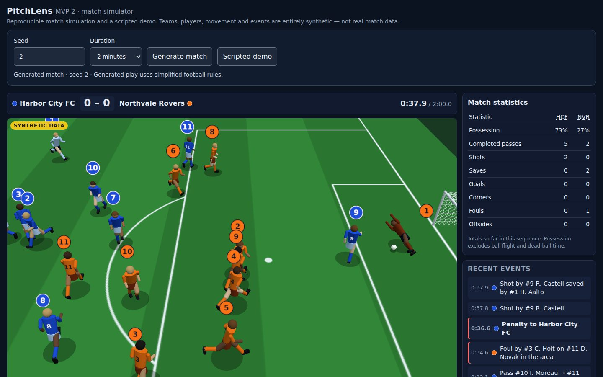

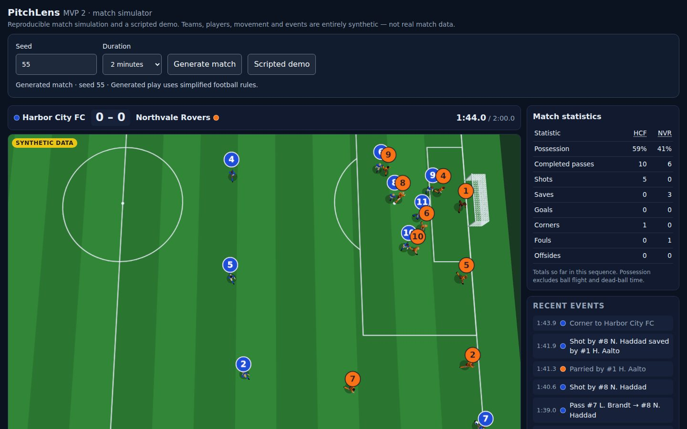

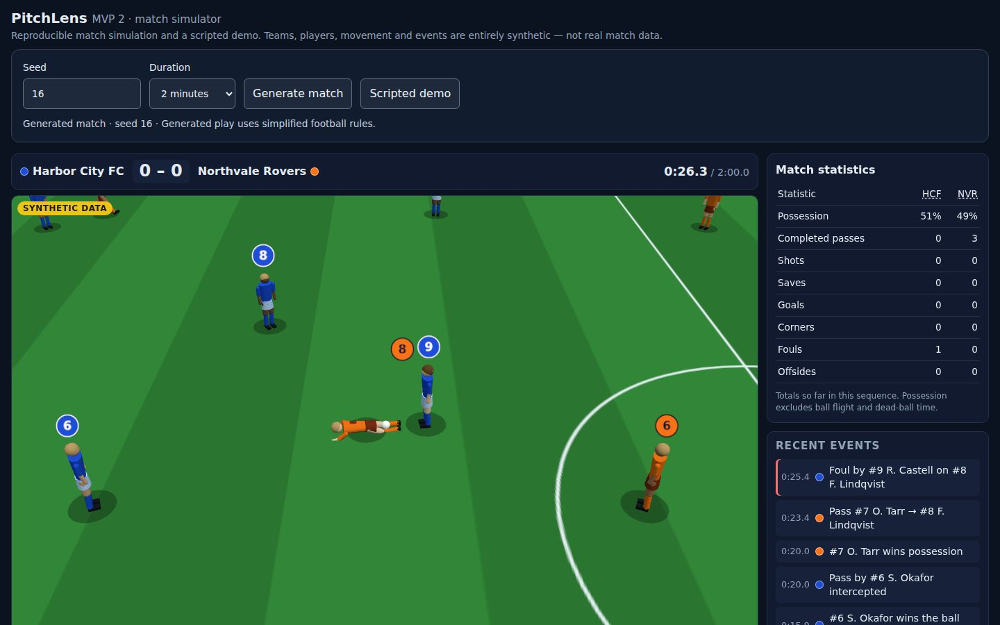

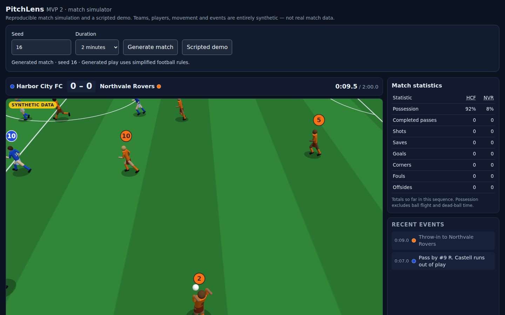

### Rules

The simulator now tracks who touched the ball last and restarts play the way the
laws of the game do, in simplified form:

- **Throw-ins.** A ball over a touchline goes to the team that did not touch it
  last. The nearest outfield player throws it in from where it crossed the line.
  They stand on the line holding the ball over their head, then throw it to a
  team-mate 4–22 m away.
- **Corners and goal kicks.** A ball over a goal line without a goal is a corner
  if a defender touched it last (a parry round the post or a deflection off a
  defender), and otherwise a goal kick. At a corner the five most advanced
  attackers go into the area, each picked up by the nearest defender standing
  goal-side. The goalkeeper stands on the line and the taker crosses to one of
  the attackers.
- **Fouls.** A challenge on the player with the ball either wins it cleanly (25%),
  is a foul (3.5%), or fails. A foul stops play with the ball where it happened.
  The fouled player goes down and takes a free kick two seconds later, with
  opponents 9.15 m away. Within 32 m of goal, three defenders form a wall on the
  line to goal. A foul inside the defending team's penalty area is a penalty:
  the striker shoots from the spot while everyone except the goalkeeper waits
  outside the area.
- **Offside.** Offside is judged when the ball is played. A team-mate is in an
  offside position when they are in the opponents' half, ahead of the ball and
  beyond the second-last defender. If one of them is the player who then
  receives the ball, including from a rebound, they are flagged. The defending
  team gets an indirect free kick there, which cannot be shot straight at goal.
  Throw-ins, corners and goal kicks are exempt. Forwards time runs along the
  defenders' line, so they sometimes drift offside. Passers usually (75%) notice
  this and look for someone else.

### Physics

- **Player collisions.** Players keep their centres 0.7 m apart. Each step,
  overlapping pairs are pushed apart, but no further than a player's top speed
  allows, so a short overlap can remain for a moment. Players no longer run
  through each other: across 24 sampled matches no two players come closer than
  0.53 m (the test requires more than 0.49 m).
- **Blocks and deflections.** An opponent's body deflects a ball that passes
  within 0.5 m of its centre, below 1.9 m. For shots this reach is 0.9 m, for a
  stretching leg. A deflected ball comes off the side it hit, slower and popping
  up, and the player who deflected it cannot play it again for 400 ms. One
  defender closes the angle between a carrier near goal and the goal, so shots
  are blocked about as often as in real football (17% of shots).
- **Saves and parries.** A goalkeeper who fails to hold a shot usually (70%) still
  gets a hand to it. The parry is pushed round the post or back out wide, and
  can lead to a corner, a scramble or, occasionally, a goal.
- **The woodwork.** The posts are upright cylinders and the crossbar is a
  horizontal one, matching the rendered goal: radius 0.07 m, with post centres
  on the goal line. The ball is swept against them each step and bounces off
  with 60% of its speed along the contact normal.

All contacts in a step are resolved in the order the ball reaches them. A goal
still needs the whole ball over the line inside the frame. A shot from very close
range can no longer climb more steeply than about 30°: before, such a shot could
leave the foot at over 50 m/s, and the crossbar made that visible.

Each shot still has exactly one result, so the statistics stay consistent:

| Result | When |
| --- | --- |
| Goal | It goes in, even off the woodwork, a block or a parry. |
| Saved | The goalkeeper holds it, or parried it first. |
| Blocked | An outfield player blocked it first. |
| Missed | Anything else. |

Touches along the way appear in the feed as **deflection** events ("Blocked by
#4", "Parried by #1", "hits the post") the moment they happen. The final result
follows when the ball is next controlled or goes out.

Across 200 seeds at 120 s every fixture is valid. A match has, on average, 3.3
shots: 17% are goals, 50% saved, 17% blocked and 15% missed. It also has 1.1
fouls, 0.1 penalties, 0.3 offsides, 0.35 throw-ins, 0.15 corners and 0.3
woodwork hits.

### Contact animations

`src/playback/animation.ts` now recognises every ball contact from snapshots
alone, using who has the ball and where it goes. Events are never read, so
animation still cannot reveal anything early:

| Contact | Recognised when | Animation |
| --- | --- | --- |
| Kick | Possession ends with the ball moving away from the foot | Backswing, strike and follow-through (MVP 5) |
| Throw | The same, from above head height | Ball held behind the head from the restart, then whipped over it |
| Receive | A player takes a free ball | A cushioning touch with the foot, or a high ball taken on the chest |
| Save | A goalkeeper takes, or turns away, a shot | Squares up to the shot. A catch at the ball's height, or a full-length dive towards it that lands on the side and gets back up |
| Tackle | Possession passes straight to an opponent, or a foul | A standing lunge when close, a slide along the grass from more than 1 m away |
| Block | A free ball turns sharply next to an outfield player | Braced, arms tucked, leaning into the ball |
| Fall | Play stops with the ball dead at the carrier's feet | Goes down face first, stays down, then gets up |

Dives, slides and falls tip the whole body over about the feet (new `tilt`,
`roll`, `rise`, `advance` and `turn` in the pose), so the player's recorded
position stays where their feet are. The shadow follows the hips. In tests
against the simulator's own events across 12 seeds, every foul, reception,
tackle, parry and throw-in is recognised, with no falls or blocks where none
happened. The pose is still a pure function of the fixture and the time.

### Data and UI

Generated fixtures are now schema **1.2.0** and match IDs are `sim-v3-…`. The
version adds the event types `throw-in`, `corner`, `free-kick`, `penalty`, `foul`,
`offside` and `deflection`, and the outcomes `blocked`, `deflected`, `committed`
and `flagged`. The old simplified restart, a `turnover` after the ball went out,
is gone. Schema 1.0.0 (the scripted demo) and 1.1.0 fixtures still validate and
play.

The statistics panel adds corners, fouls and offsides. In the events panel,
fouls, offsides and penalties are marked in red, and restarts and deflections
are dimmed.

### Not in this milestone

- No cards, advantage, handball, drop balls or substitutions. Every foul is
  given.
- No headers: a ball above control height can only be blocked, not played.
- Players do not jump to challenge for the ball. A collision only moves players
  apart; nobody is knocked over except by a foul.
- At a penalty the goalkeeper starts on the line but steps out towards their
  usual spot before the kick. Free kicks are taken by the player who was
  fouled, without a run-up.
- The ball does not hit the net's side or roof from outside the goal. The posts
  and crossbar are the only woodwork.
- Corner and throw-in rates are below real football, because the simulator has
  few crosses or clearances to put the ball out.

### Validation

New and updated tests:

- `tests/rules.test.ts`:
  - Every new event appears across 24 seeds.
  - Players never pass through each other.
  - Fouls stop play where they happen and restart two seconds later with a free
    kick or a penalty, with opponents back the required distance.
  - Penalties are shot from the spot, and near-goal free kicks get a wall.
  - Every flag is for a player who was in an offside position at the pass, and
    no completed pass went to one (outside the exempt restarts).
  - Indirect free kicks are not shot at goal.
  - Woodwork contacts are on the post or bar surface and send the ball back off
    it.
  - Shot results, fouls, corners and offsides match the statistics.
- `tests/ball-simulation.test.ts`:
  - Out-of-play restarts go against the last toucher, as a throw-in from the
    crossing point, a corner from the right corner, or a goal kick.
  - Throw-ins leave from the hands.
  - Every deflection is within reach of the player who made it.
  - Each shot has one result consistent with what touched it.
- `tests/animation.test.ts`:
  - Recognition matches the simulator's events.
  - Every recognised dive lays the keeper out towards where the ball was.
  - Each pose has the expected geometry: a dive towards the ball, overhead
    catches, a face-down fall, a feet-first slide, the throw-in hold and
    release, and foot and chest receptions.
  - Every animation blends in from, and back out to, the ordinary pose.

`npm run typecheck` and `npm run build` pass. I checked each new animation in the
production build in headless Chromium (SwiftShader) at 1440×900, and a generated
match playing at 390 px wide. There were no console errors and no horizontal
scroll.

## Formations and formation changes (MVP 7)

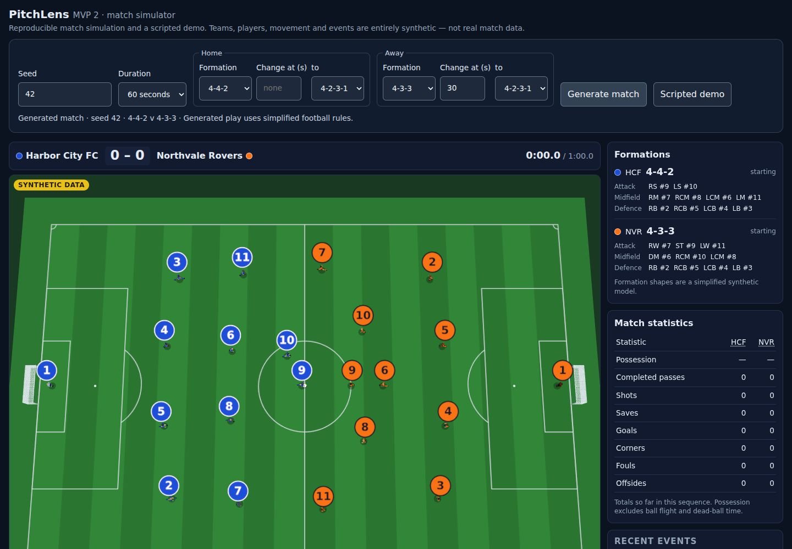

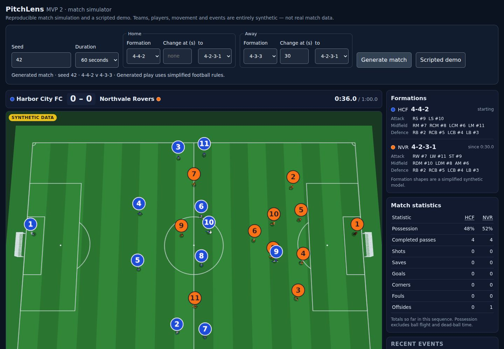

Each team now plays in a formation, which can differ between the teams and can
change at scheduled times during the match. The formation decides where each
player stands and how they move off the ball for the whole match, not just at
kickoff.

### Presets and slots

`src/match/formations.ts` defines **4-4-2**, **4-3-3** (the default) and
**4-2-3-1**. Each has one goalkeeper slot and ten outfield slots. A slot has:

- an ID that is unique within the formation, such as `LCB`, `RS` or `AM`
- a tactical position: `GK`, `RB`, `CB`, `LB`, `DM`, `CM`, `RM`, `LM`, `AM`,
  `RW`, `LW` or `ST`
- a neutral spot, given relative to the attacking direction: `depth` is metres
  from the team's own goal line, and `lateral` is metres to the left of the
  centre line, as seen facing the goal the team attacks

`slotSpot` converts a slot to pitch coordinates. The two attacking directions
are a half turn of each other, so a left back is on their own left whichever
way their team attacks. All neutral spots are in the team's own half, so
kickoff positions are always legal.

A slot only says where a player plays. Player IDs, names, shirt numbers and the
roster `role` do not change.

### Configuration

```ts
generateMatch({
  seed: 42,
  durationMs: 60_000,
  tactics: {
    home: { formation: "4-4-2" },
    away: {
      formation: "4-3-3",
      assignments: { "nvr-1": "GK", "nvr-2": "RB" /* …every away player once */ },
      changes: [{ t: 30_000, formation: "4-2-3-1" }],
    },
  },
});
```

- `formation` defaults to 4-3-3.
- `assignments` maps each player ID of the team to one slot ID. By default, the
  roster goalkeeper goes in goal and each outfield slot gets its usual shirt
  number (the 9 up front, the 2 at right back, and so on). Any slot left over
  takes the remaining players in roster order.
- Custom assignments are checked before simulating. The simulator rejects a
  missing player, a player from the other team or not in the roster, an unknown
  or duplicated slot, and anyone other than the roster goalkeeper in the `GK`
  slot.
- `changes` lists formation changes, each with an optional `assignments`. By
  default, players move to the nearest free slot of the new formation (nearest
  pairs first, ties to the earlier slot and then the earlier roster entry), so
  the team reshapes with as little running as possible. The goalkeeper stays
  in goal.

In the UI, each team has a **Formation** selector and an optional **Change at
(s)** time with the new formation. The time must be strictly between 0 and the
selected duration, with at most one decimal. Times outside that range are
rejected with a message, and nothing is generated.

### Timing semantics

- A change time is integer milliseconds of simulation time. It must be after
  kickoff and before the end of the match (`0 < t < durationMs`) and a
  multiple of the 20 ms simulation step. A team can change only once at any
  given time. It can change several times at different times; each change
  starts from the formation before it.
- A change is applied once, at the start of the step at exactly its time,
  before any restart or player movement in that step. Changes at the same time
  are applied home team first, then away.
- Each change emits a `formation-change` event (outcome `applied`) at that time,
  plus a snapshot. It does not stop play. Positions are not cut, the ball,
  possession and any pass or shot in flight carry on untouched, and the restart
  clock does not change. Players then run to their new spots within the normal
  speed limit.
- **During a stoppage**, players walk towards their restart positions in the new
  formation. A kickoff or goal kick taken at or after the change lines up in
  the new formation. A change at the same time as a restart counts for that
  restart. For throw-ins, corners, free kicks and penalties, players are placed
  the same way as before. Players not involved in the restart stay where they
  walked to.
- Every kickoff and goal kick lines up in the team's *current* formation, never
  the starting one. The kickoff and any penalty are taken by the player in the
  current formation's first `ST` slot.

### Role-aware movement

Each position has a movement profile in `MOVEMENT_PROFILES`
(`src/simulation/generate.ts`). Off the ball, a player's target is their
slot's neutral spot, adjusted by the profile:

| Profile setting | Effect |
| --- | --- |
| `follow`, `slide` | How much the player shifts with the ball along and across the pitch |
| `push` | How far they move up while their team has the ball. Full backs push on furthest, centre backs least |
| `width` | How far they spread while attacking. Wingers and full backs go wide |
| `tuck` | How far they narrow while defending |
| `drop`, `recover` | How far they drop while defending, and how far upfield of the ball they may stay. Centre backs stay goal-side of the ball; strikers stay up as an outlet |
| `runs` | Whether they time runs along the defenders' offside line (strikers and wingers) |

Because positions differ, players do not share the same offsets and do not all
chase the ball. Pressing, cutting out passes, covering shots, chasing loose
balls, goalkeeping, collisions, ball contacts and restarts work as before.
These profiles are a simplified synthetic model. They have not been validated
against real tactical data.

### Rules integration

The PR #7 rules are reused unchanged:

- Offside is still judged from players' and the ball's actual positions at the
  moment of the pass, never from slots or labels.
- Throw-ins, corners and goal kicks are still exempt from offside.

The rules tests now also run on 12 matches with mixed formations and
mid-match changes. Two integration fixes came out of them:

- **No stacked players at restarts.** Restart positions are placed directly.
  Before, the centre-circle push at kickoff could stack two players on one
  spot, as could a free-kick taker placed next to their goalkeeper. Opponents
  now leave the circle straight out from the centre, and any player standing
  on top of another steps 0.7 m away. The taker never moves.
- **The kicker cannot play their own kick again for 400 ms.** Before, a shot
  struck from point-blank range into the goalkeeper could bounce straight back
  to the shooter in the next step. The animation's block and parry recognition
  applies the same rule.

### Data, identity and compatibility

- Generated fixtures are schema **1.3.0**. This version adds the
  `formation-change` event type, the `applied` outcome, and two optional
  fixture fields:
  - `generator`: `{ simulatorVersion, seed, configKey }`
  - `tactics`:
    - `initial`: each team's starting formation and assignments
    - `scheduled`: the configured changes, with resolved assignments, in
      processing order
    - `applied`: each change with its team, time, previous and new formation,
      previous and new assignments, and the ID of its event
- Match IDs are `sim-v4-<seed>-<durationMs>-<configKey>`. `configKey` is a
  short FNV-1a hash of the resolved configuration, and `4` is
  `SIMULATOR_VERSION`. Two different configurations therefore never share an
  ID. Writing out the defaults explicitly resolves to the same configuration,
  and so to the same ID and the same match.
- The same seed, configuration and simulator version produce identical output.
- Schema 1.0.0 (the scripted demo), 1.1.0 and 1.2.0 fixtures still validate and
  play. Without `tactics` there is no formation panel. A `formation-change`
  event without `tactics` is rejected.
- The validator checks the `tactics` metadata:
  - exactly one valid starting formation and assignment per team
  - applied changes in time order, inside the match, chaining from the
    previous formation
  - each change matched by a `formation-change` event with the same ID, time
    and team

### Playback

A **Formations** panel shows each team's active formation at the playback time,
with when it took effect and who is in each slot. `formationsAt(fixture, t)` in
`src/playback/derive.ts` derives it from `initial` plus the applied changes up
to `t`, and it is also part of each `PlaybackFrame`. Seeking back restores the
earlier formation, restarting restores the starting one, and a change never
shows before its time. Changes appear in the event feed with an accent bar. The
statistics ignore them.

### Limitations

- There are only three presets. The UI offers one scheduled change per team; the
  API allows any number.
- There are no substitutions, keeper swaps or player-specific attributes: any
  outfield player plays any outfield slot equally well.
- The default reassignment after a change minimises running, not tactical sense.
  For example, the defensive midfielder of a 4-3-3 becomes the attacking
  midfielder of a 4-2-3-1. Pass custom `assignments` to choose otherwise.
- Set-piece roles do not depend on position: the throw-in and corner taker is
  the nearest outfield player, and the corner runners are the most advanced.
- Event rates shift a little with the new movement. Corners, throw-ins and
  penalties remain rarer than in real football (see MVP 6).

### Validation

`tests/formations.test.tsx` covers:

- each preset has exactly 11 unique slots, one goalkeeper, and spots in its own
  half
- left and right are labelled consistently, and the two attacking directions
  mirror correctly
- default and remapped assignments put every rostered player of the right team
  in exactly one slot, and invalid custom assignments are rejected
- teams can start in different formations, each mirrored for its direction
- the same seed and configuration reproduce identical output, a different
  configuration changes the match ID, and explicit defaults give the same match
- positions keep their depth order on average, and no two players share a spot
- a change:
  - applies once, at exactly its time, and is recorded in full
  - leaves everything before it identical
  - respects the speed limit, with no cut
  - leaves the ball, possession and a pass in flight untouched
- changes at the same time go home team first, several changes chain, and bad
  times are rejected
- a change during a stoppage is used by the following goal kick, without
  changing when or by whom it is taken
- across all nine formation pairings, with a mid-match change:
  - kickoffs and goal kicks line up in the current formation
  - kickoffs are legal
  - the kickoff and penalties go to the `ST` slot
  - free kicks, corners and throw-ins stay legal
- playback shows the right formation at every time when seeking forward and
  back and after a restart, never shows a future one early, and renders the
  panel and feed entry
- the scripted demo and 1.2.0 fixtures still work, and inconsistent formation
  metadata is rejected
- the UI turns its inputs into tactics configuration and rejects out-of-range
  change times

The offside, foul, penalty, wall, corner, throw-in, collision and woodwork tests
in `tests/rules.test.ts` now also run on matches with mixed formations and
changes. The animation and ball-physics samples also include such matches.

`npm test`, `npm run typecheck` and `npm run build` pass. I checked the
production build in headless Chromium:

- 4-4-2 against 4-3-3 at kickoff
- the away team switching to 4-2-3-1 at 0:30
- seeking back before the change, which shows 4-3-3 again and removes the feed
  entry
- the error for a change time beyond the duration
- the scripted demo, which has no formation panel

## Explain this moment: evidence and response contract

The first backend step towards an "Explain this moment" feature: the
evidence and response contract, with no model or network calls. The
server-side model workflow that builds on it is described in the next section.

- `extractMatchContext(fixture, t, options?)` in `src/explain/context.ts`
  builds a compact, deterministic, JSON-serialisable evidence package for one
  playback time: match identity and the synthetic label, the score, teams and
  players, active formations and slots (when the fixture has them), recent
  events with their IDs, the latest positions, and coded limitations.
- Nothing from after the selected time is included. Events count only once
  revealed (`t ≤ selected time`), so a pass in flight or an offside not yet
  called is absent, and a shot's result and destination are withheld until
  its result is revealed. Positions come from the latest snapshot at or before
  the time, never interpolated towards the next one. Scheduled formation
  changes are never included.
- The package is bounded: a 10 s lookback window, at most 20 events and 6
  snapshots, and 24 KB of JSON by default, all configurable within fixed
  limits. Invalid times and options throw a `RangeError`.
- `validateExplanation(response, context)` in `src/explain/response.ts` checks
  a structured response (headline, plain-language explanation, cited facts,
  cited tactical interpretation, limitations, and an `insufficient-evidence`
  status). Every citation must resolve to an event or snapshot in the context,
  and facts may not assert intent or cause. The contract is provider-independent
  and comes with a JSON Schema for structured output.

See [docs/explain-this-moment.md](docs/explain-this-moment.md) for the API,
response schema, timestamp semantics, payload limits and examples.
`tests/explain-context.test.ts` and `tests/explain-response.test.ts` cover
goals, offsides, formation changes, seeking backwards, actions in flight,
fixtures without tactics, invalid input, payload bounds and invalid responses.

## Explain this moment: analyst service

`POST /api/explain` explains a paused moment with a model deployed on
**Microsoft Foundry**, called through Foundry's OpenAI-compatible v1 chat
completions API from the Next.js server. The viewer does not call it yet.

- **Request:** a match reference, a time and an audience (`casual` or
  `analyst`). The browser never sends match data. The scripted demo is named
  by ID; a generated match by the recipe that produced it, which the server
  reruns with the simulator and accepts only if it reproduces the same
  `matchId`.
- **Analyst:** gets the evidence package and may call two tools that return
  earlier events and positions, never anything after the selected time. The
  cutoff is enforced in code, and the model has no access to the fixture or
  the simulator.
- **Checks:** the response contract and citations, deterministic wording
  checks (no later times, wrong scores, uncited players or events that are not
  in the evidence), then a verifier model's review of the headline,
  explanation and every claim. One revision is allowed; otherwise the answer is
  the standard insufficient-evidence fallback. A model review is not proof.
- **Limits:** model calls, tool calls, tokens and time are capped. Missing
  configuration, timeouts, provider throttling and failures map to documented
  error codes. Credentials stay on the server; requests are rate-limited,
  cached and size-limited.
- **Tracing:** one JSON log line per request with model and tool calls,
  evidence IDs, timings and check outcomes, without prompts, model text or
  secrets.

Setup uses placeholders in `.env.example`; without them the endpoint answers
`503 not-configured` and nothing else changes. See
[docs/explain-service.md](docs/explain-service.md) for the contract, the
Agent Framework evaluation, the limits and the abuse controls. `npm test` runs
the mocked suites; `npm run test:live` runs the opt-in live evaluation.

## Broadcast mode (MVP 8)

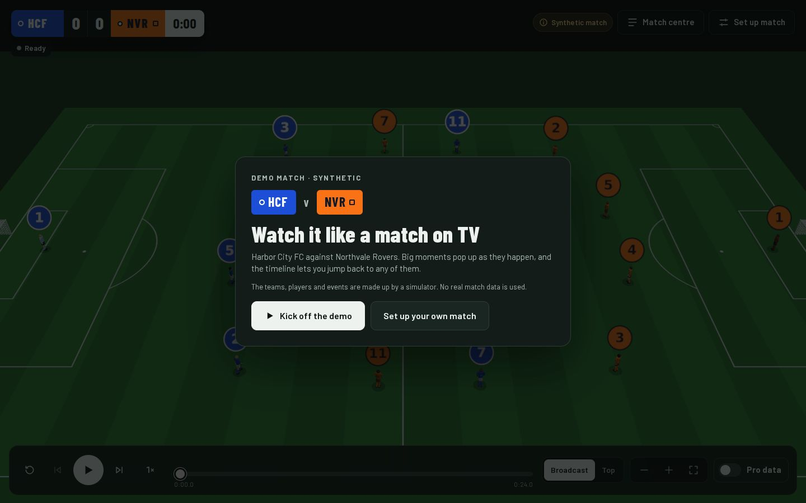

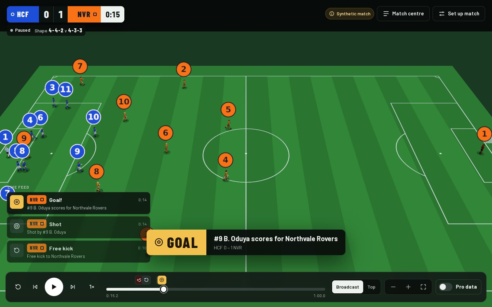

The viewer has been redesigned to work like a football match on TV or in a
console game, so a first-time fan can follow it without instructions:

- **Full-screen pitch.** The 3D view fills the window. Everything else floats
  over it. The camera starts in the **Broadcast** view (the existing angled
  camera); **Top** is one tap away.
- **Score bug.** Top left, as on TV: both teams with their short name and
  shape (home circle, away square, so team identity never depends on colour
  alone), the score and the clock. A ball dot marks the team in possession, and
  both teams' current formations sit underneath.
- **Moment pop-ups.** A **GOAL** graphic with the scorer and new score shows for
  5 s. **TACTICAL CHANGE** with the old and new shape shows for 6 s. **FOUL**,
  **OFFSIDE** and **PENALTY** show for 2.5 s.
- **Live feed.** Up to three key moments from the last 12 seconds slide in at
  the side and clear themselves. Each has a plain title (“Free kick”, “Save”)
  and the simulator's description.
- **Match centre.** Opened from the top right, it floats over the pitch
  instead of shrinking it. It has three tabs:
  - **Moments:** key moments or every touch, newest first. Selecting one
    explains it in a sentence and offers *Replay from 3 s before*.
  - **Stats:** the match statistics, with a short glossary.
  - **Formations:** a mini pitch with shirt numbers, who plays where, and the
    changes so far.
- **Control bar.** One bar at the bottom, like a video player. Previous and
  next jump between *key moments*: goals, shots, stoppages, restarts and
  formation changes, not every pass. The timeline shows an icon button for each
  moment reached so far. A selected moment is labelled on screen, so nothing
  depends on hovering.
- **Set up match.** A drawer for:
  - match length
  - each team's starting formation, with small diagrams
  - an optional change during the match
  - the seed, under *Advanced options*

  The drawer always says what is being watched now. It shows *Not applied yet*
  until a new match is generated. Problems are explained per field. The summary
  names the field to fix, and focus moves to it.
- **Phones.** In portrait, the pitch sits on top, with large controls and the
  feed below; Match centre opens as a bottom sheet. In landscape, the layout is
  a compact full-screen TV view.

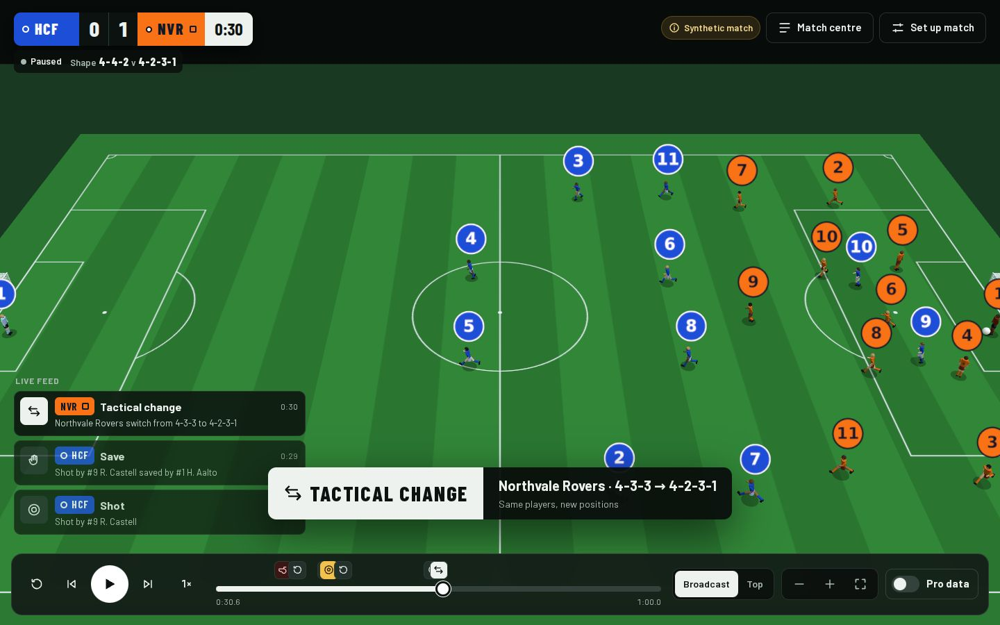

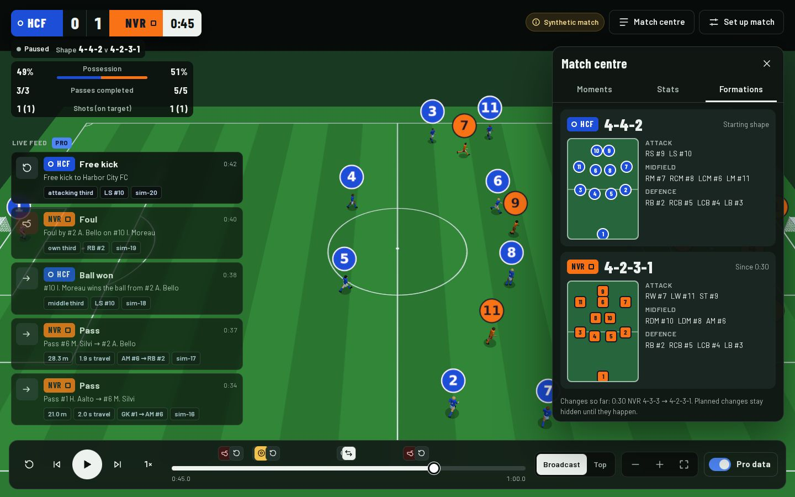

### Pro data

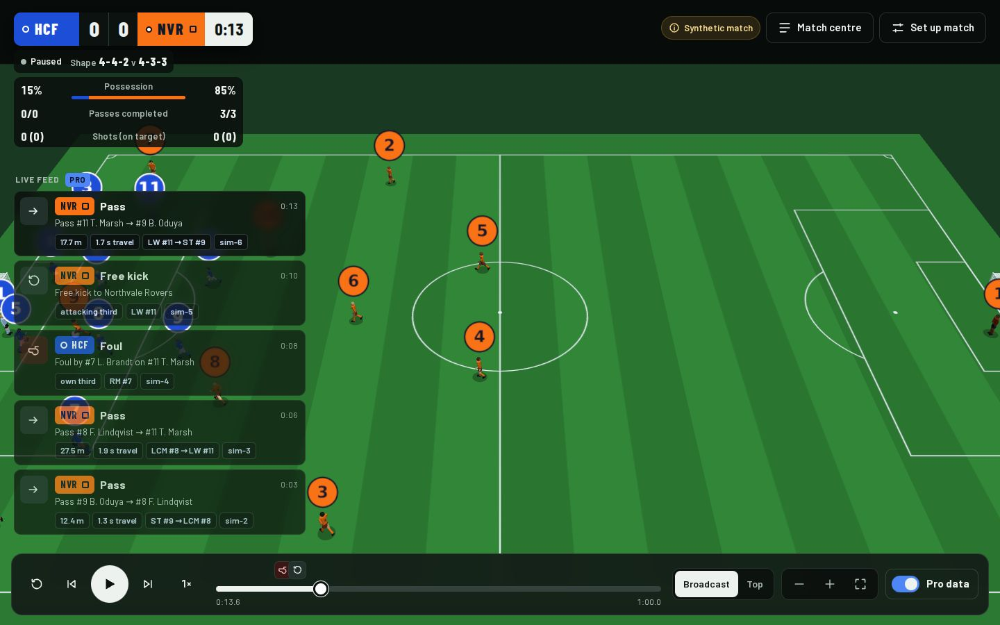

The **Pro data** switch is for fans who want more:

- **Feed:** every event from the last 20 seconds (up to five), passes and balls
  won included, each with data chips.
- **Score bug:** a panel with possession, passes completed out of attempted,
  and shots with how many were on target.
- **Stats tab:** extra rows for pass completion, average completed pass
  length, shots on target and balls won.

The choice is remembered for each browser in `localStorage`, guarded so the app
works without it. It never changes the match.

Every Pro figure is read or computed from fixture data in
`src/playback/proData.ts`. No ratings or expected-goals numbers are invented.

| Chip | Example | Source |
| --- | --- | --- |
| Pass length | `17.7 m` | pass `start` → `end` |
| Travel time | `1.7 s travel` | `t − startT` |
| Positions | `LW #11 → ST #9` | `playerId` / `recipientId` + formation active at the event |
| Shot distance | `7.3 m from goal` | shot `start` to the centre of the goal attacked |
| Ball height | `at 1.4 m high` | `end.z` of a goal or shot result |
| Pitch zone | `attacking third` | event `start.x`, measured from the acting team's own goal |
| Reshape size | `3 of 11 change position` | `tactics.applied` assignments vs the previous ones |
| Event ID | `sim-8` | `event.id` |

“Shots on target” counts goals scored by a player (not own goals) plus saves.

### Unchanged by design

- Playback, the simulator, rules, physics and the fixture contract are
  untouched.
- `src/playback/moments.ts` and `proData.ts` are pure functions of the fixture
  and the time, like `derive.ts`. Pop-ups, feed cards, markers, stats and
  formations never show anything after the current time. Seeking back restores
  the earlier formation, and restart restores the starting one.
- The scripted demo and fixtures from schema 1.0.0 to 1.3.0 still load.
  Without formation data, the score bug omits the shapes and Match centre
  explains why.
- *Explain this moment* is still a labelled concept in Match centre. The
  evidence extractor in `src/explain/` is not connected to the UI.

### Accessibility

- Team identity is shown by name and shape as well as colour.
- Every control is a native button, switch, input or select with a name.
  Icon-only buttons have `aria-label`s, and timeline markers say, for example,
  “0:14 Goal, Northvale Rovers”.
- Focus shows a visible 3 px ring. Touch targets are 44 px or larger, and the
  play button is 54 px (64 px on phones).
- The set-up drawer is a modal dialog: focus moves in, Tab stays inside, Esc
  closes it, and focus returns to the button that opened it.
- The live feed is a polite live region, and pop-ups use `role="status"`.
- `prefers-reduced-motion` turns off all CSS animation and the camera easing.
- The fonts (Barlow and Barlow Condensed) are self-hosted by `next/font` at
  build time, so the app still makes no network calls at runtime.

### Phones

| Portrait | Pro data | Match centre |
| --- | --- | --- |
| 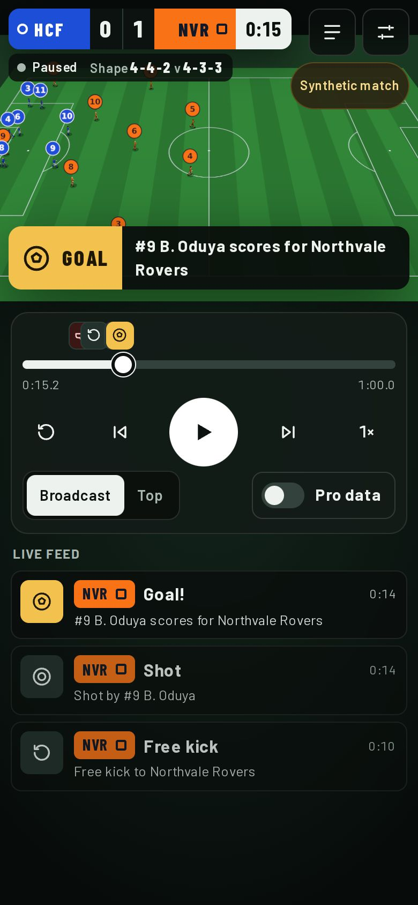 | 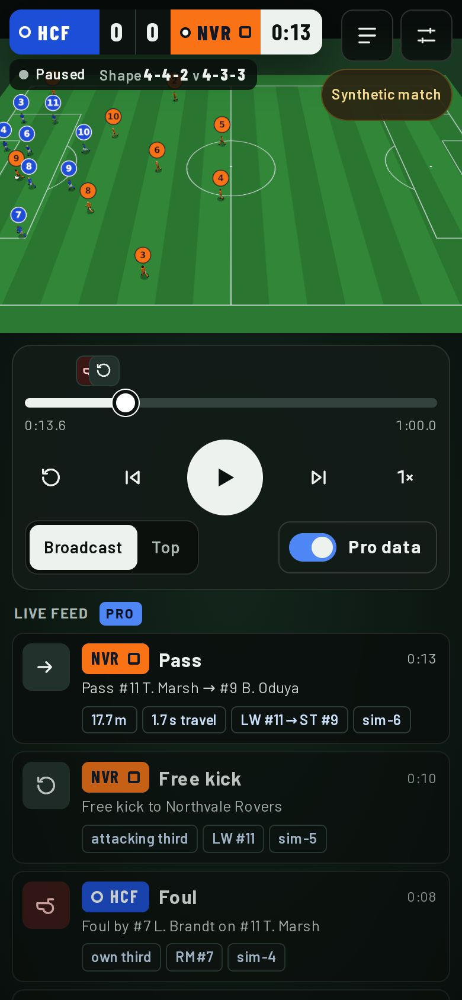 | 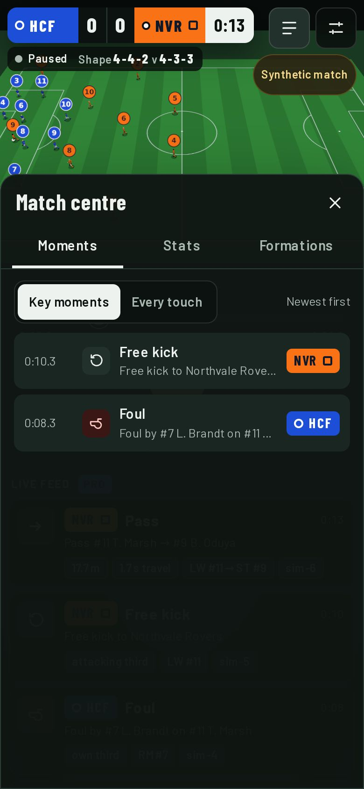 |

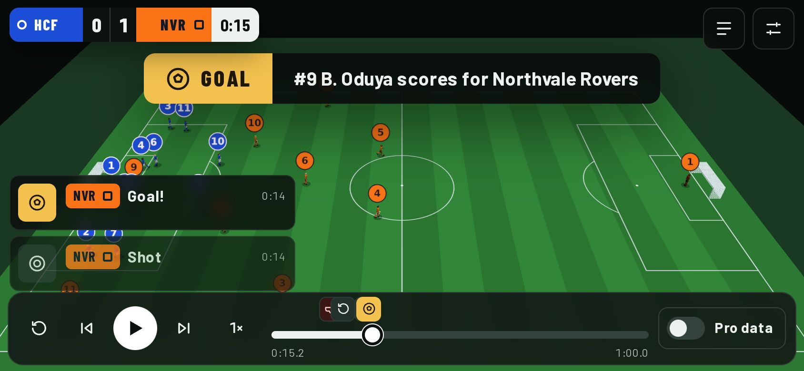

### Limitations

- Player position labels (ST, LCB…) appear in Pro feed chips, the moment
  details and the Formations tab, not on the 3D players.
- The live feed lists recent moments only; the full history is in Match centre.
- The flat 2D fallback for devices without WebGL is still only a proposal.
  Without WebGL, the 3D area shows a message.
- Keyboard shortcuts (such as Space for play) are not added yet. Every control
  is reachable with Tab.

### Validation

- `tests/broadcast.test.tsx` covers:
  - the no-future guarantee for markers, pop-ups, the feed and Pro chips,
    probed every second of both the scripted demo and a generated match
  - stepping between key moments only
  - pop-up timing
  - feed limits with and without Pro data
  - pass length, travel time and position chips against the raw event data
  - Pro totals consistent with `statisticsAt`
  - the score bug's shapes at, and just before, a formation change
  - Match centre tabs, Pro rows, the formation history and the scripted demo's
    empty state
  - set-up validation, the “Not applied yet” state, and regenerating an
    identical match from a recovered set-up
- The timeline, viewer and formation tests were updated for the new markup and
  keep the same guarantees.
- `npm test` (452 tests), `npm run typecheck` and `npm run build` pass.
- The production build was driven in headless Chromium (SwiftShader WebGL) at
  1440×900, 390×844 and 844×390:
  - the demo, generating seed 46 (4-4-2 v 4-3-3, with NVR switching to 4-2-3-1
    at 0:30), seeking, a selected moment, Pro data, Match centre, the Top view,
    full time and a set-up error
  - seeking back to 0:20 after the change shows 4-4-2 v 4-3-3 again
  - no console errors and no horizontal scrolling at any size
